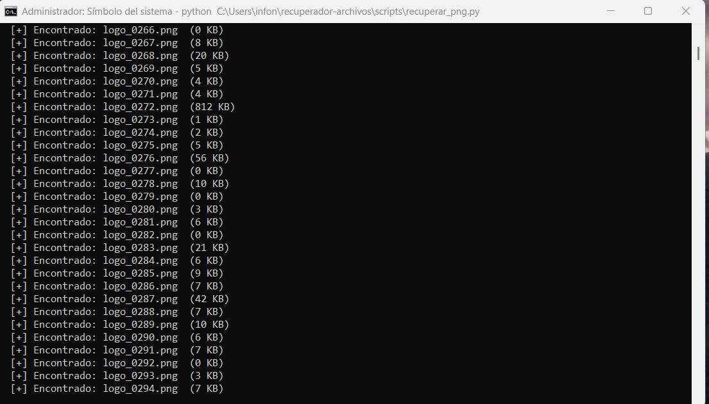
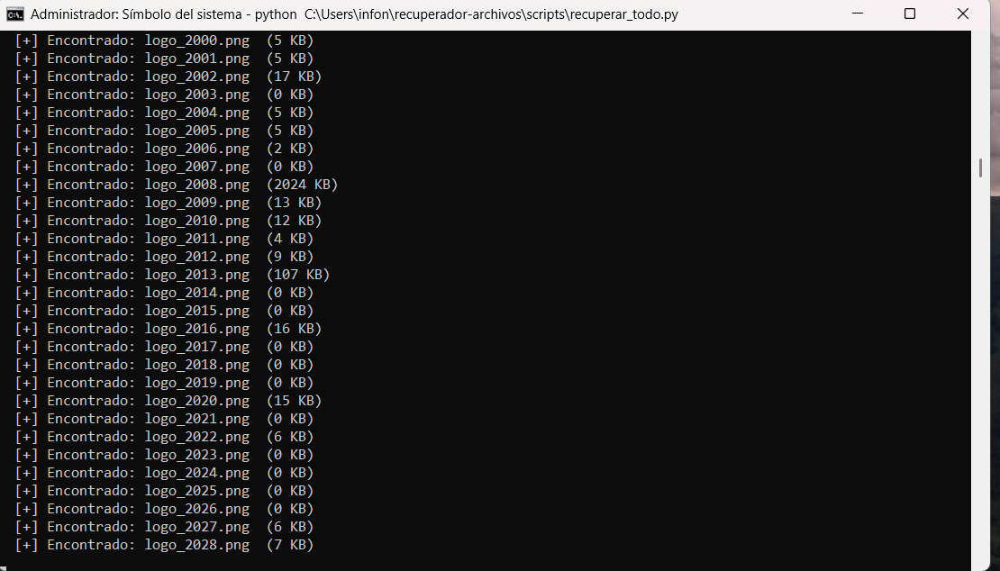

<div align="center">

# Recuperador de Archivos

**Recupera archivos borrados del disco duro usando Python — gratis, sin limites, codigo abierto.**

[](https://www.python.org/)
[](LICENSE)
[](https://www.microsoft.com/windows)
[](https://github.com/365diascollaboration-prog/recuperador-archivos/stargazers)
[](https://github.com/365diascollaboration-prog/recuperador-archivos)

</div>

---

## Historia real

Borre OneDrive por error y con el se fueron todas mis carpetas — logos, fotos, proyectos. No estaban en la papelera, no estaban en la nube. Las herramientas gratuitas devolvian basura y las buenas cobraban $89.

Entonces construi mis propias herramientas. Funcionaron. Y las estoy compartiendo con todo el mundo.

---

## Como funciona

Cuando borras un archivo, el sistema operativo no elimina los datos del disco — solo marca ese espacio como disponible. Los datos permanecen hasta que otro archivo los sobreescriba.

Cada tipo de archivo tiene una **firma binaria unica** (magic bytes). Los scripts leen el disco sector por sector buscando esas firmas y extraen los archivos completos.

```
Disco duro  →  Lectura cruda  →  Busqueda de firmas  →  Extraccion  →  Archivos recuperados
```

---

## Requisitos

- Windows 10 / 11
- Python 3.x
- CMD abierto como **Administrador**
- Disco externo o USB donde guardar los archivos recuperados

---

## Instalacion

```bash
git clone https://github.com/365diascollaboration-prog/recuperador-archivos.git
cd recuperador-archivos
```

No requiere dependencias externas. Solo Python puro.

---

## Uso

### Recuperar todo de una vez

```bash
python scripts/recuperar_todo.py
```

### Recuperar por tipo de archivo

```bash
# Imagenes PNG
python scripts/recuperar_png.py

# Fotos JPG
python scripts/recuperar_jpg.py

# Videos MP4, MOV, MKV, WEBM
python scripts/recuperar_videos.py

# Documentos PDF, Word .doc y .docx
python scripts/recuperar_docs.py

# Musica MP3, OGG, FLAC
python scripts/recuperar_mp3.py

# Vectores SVG, EPS, AI y archivos HTML
python scripts/recuperar_vectores_html.py
```

---

## Scripts disponibles

| Script | Formatos | Carpeta de salida |
|--------|----------|-------------------|
| `recuperar_todo.py` | Todos | Multiples carpetas |
| `recuperar_png.py` | PNG | `PNGs_recuperados/` |
| `recuperar_jpg.py` | JPG | `JPGs_recuperados/` |
| `recuperar_videos.py` | MP4, MOV, MKV, WEBM | `Videos_recuperados/` |
| `recuperar_docs.py` | PDF, DOC, DOCX | `Documentos_recuperados/` |
| `recuperar_mp3.py` | MP3, OGG, FLAC | `Musica_recuperada/` |
| `recuperar_vectores_html.py` | SVG, EPS, AI, HTML | `Vectores_HTML_recuperados/` |

---

## Personalizar carpeta destino

Abre el script y cambia la variable `OUTPUT`:

```python
OUTPUT = r'D:\mi_carpeta\recuperados'
```

Siempre guarda en un **disco diferente** al que estas escaneando.

---

## Capturas de pantalla

### Script corriendo en CMD


### Archivos recuperados


### Script maestro


> Las capturas se agregan proximamente. Si quieres contribuir con tus propias capturas, abre un PR.

---

## Consejos importantes

- **No instales ni descargues nada** mientras corre el script — cada escritura puede sobreescribir los datos que quieres recuperar
- **Guarda en otro disco** — nunca en el mismo C: que estas escaneando
- **Mientras mas reciente el borrado**, mayor probabilidad de recuperar los archivos
- Si encuentras muchos archivos de sistema mezclados, es normal — ordena por tamano para encontrar los tuyos

---

## Skills para Claude Code AI

Este proyecto incluye skills para agentes de IA. Si usas Claude Code, escribe:

```
/recuperar       → El agente diagnostica y guia todo el proceso
/recuperar-todo  → Guia para correr todos los scripts
/recuperar-png   → Guia especifica para PNG
/recuperar-jpg   → Guia especifica para JPG
/recuperar-videos
/recuperar-docs
/recuperar-mp3
/recuperar-vectores
```

---

## Contribuir

Pull requests bienvenidos.

- Agrega soporte para nuevos formatos de archivo
- Mejora la deteccion de firmas binarias
- Agrega interfaz grafica
- Traduce la documentacion

---

## Licencia

MIT License — libre para usar, modificar y distribuir.

---

<div align="center">

Hecho con frustracion, Python y mucho cafe.

**Si te ayudo, dale una estrella al repo.**

[](https://github.com/365diascollaboration-prog)

</div>
